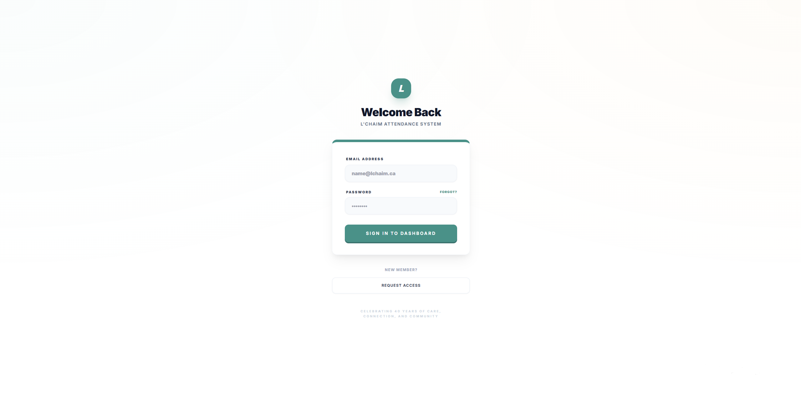
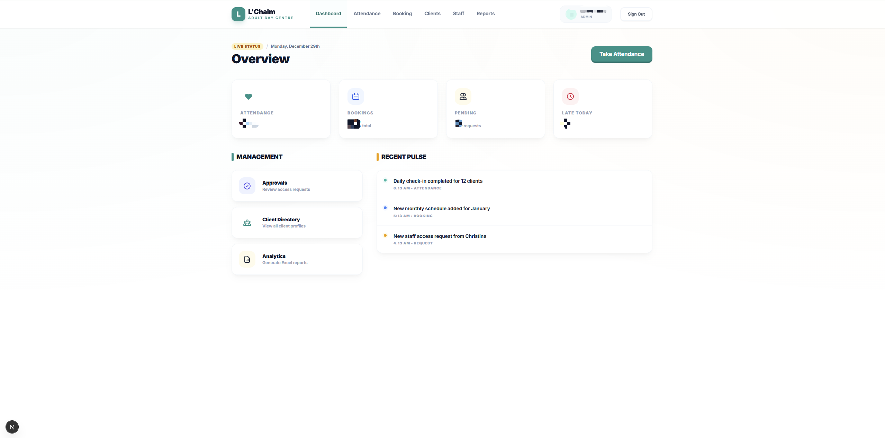
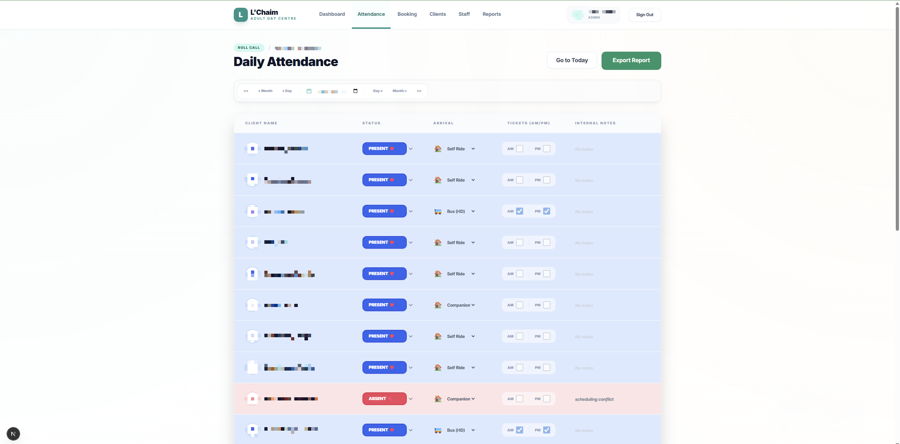
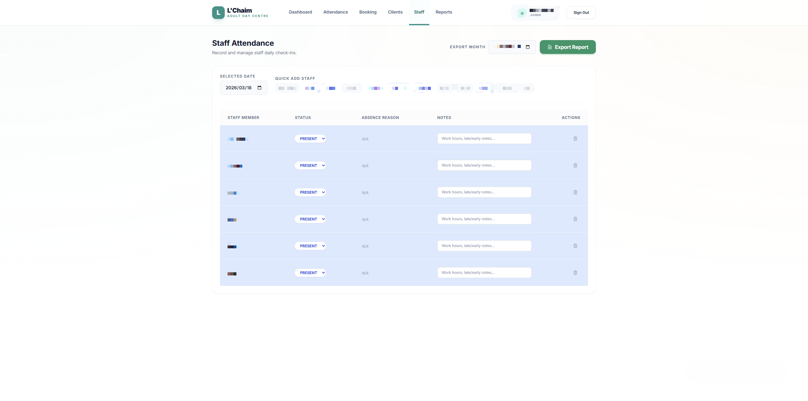
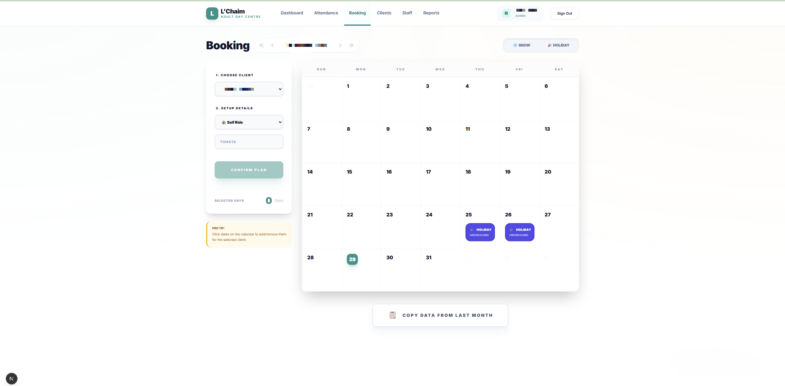
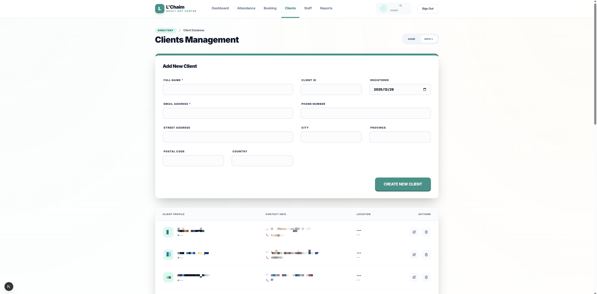
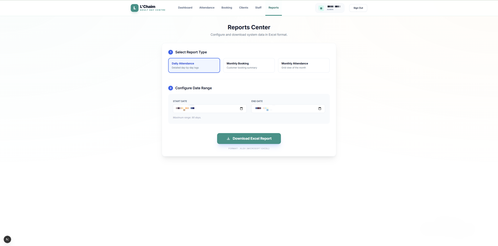

# L'Chaim Attendance System — Showcase

A sanitized showcase of a production-oriented attendance and booking management platform built with Next.js, TypeScript, and Supabase.

This project highlights real workflow design, full-stack implementation, and iteration based on operational feedback rather than a static demo scenario.

## Overview

This repository presents a portfolio-safe showcase version of the L'Chaim Attendance System. It was built for real operational use to manage attendance, bookings, customer information, and staff workflows in one centralized platform.

This showcase version removes sensitive business details, deployment secrets, and private client data while preserving the project structure, technical decisions, and implementation highlights.

## Project Background

The system was created to replace fragmented manual workflows and spreadsheet-based tracking. The goal was to support day-to-day operations with a cleaner and more reliable workflow for attendance, booking, and customer management.

## My Role

I worked on this project as a full-stack developer and handled key parts of the product implementation, including:

- Designing the main attendance and booking workflows
- Building role-based pages and access logic
- Integrating frontend pages with Supabase/PostgreSQL
- Implementing attendance tracking, booking management, and customer records
- Iterating on UI/UX details based on real user feedback
- Investigating and fixing production issues related to attendance states and workflow edge cases
- Using AI tools to accelerate prototyping, debugging, and code refinement, while keeping architecture and implementation decisions under my control

## Core Features

- Role-based access for admin and staff workflows
- Daily attendance management
- Monthly booking workflow
- Customer profile management
- Export and reporting support
- Operational dashboard for daily use

## Tech Stack

- **Frontend:** Next.js, TypeScript, Tailwind CSS
- **Backend:** Next.js server/API logic
- **Database:** Supabase / PostgreSQL
- **Authentication:** NextAuth.js
- **Deployment:** Vercel
- **Other Tools:** XLSX export, QR-related workflow support

## Key Engineering Challenges

Some of the practical engineering challenges in this project included:

- Keeping attendance states consistent across workflows
- Handling real-world edge cases in booking and attendance data
- Supporting role-based interfaces without overcomplicating navigation
- Refining the UI for operational use on different devices
- Iterating quickly based on real user feedback

## Production Iteration Highlights

This project was not just a static demo. It was iterated based on real operational feedback and practical workflow issues.

Examples of product and engineering iteration included:

- Refining attendance state handling to reduce workflow confusion
- Adjusting UI structure for clearer day-to-day operational use
- Improving role-based workflows for staff and admin users
- Making interface changes based on actual usage patterns and feedback
- Fixing edge cases that affected reliability in attendance and booking views

## Demo / Preview

- **GitHub Repository:** https://github.com/9OwO6/lchaim-attendance-system-showcase
- **Architecture Notes:** [docs/architecture.md](docs/architecture.md)
- **Live Demo:** Available upon request / private client deployment
- **Code Access:** This repository is a sanitized showcase version for portfolio and interview review

## Product Walkthrough

### 1. Login Page
Secure login entry point for staff and admin users.

### 2. Dashboard
Central operational overview for daily usage, including attendance visibility and workflow entry points.

### 3. Daily Attendance
Main attendance management view for handling day-to-day attendance records and operational updates.

### 4. Staff Attendance View
A focused workflow page for staff-side attendance handling and status review.

### 5. Monthly Booking
Calendar-oriented workflow for managing scheduling and booking operations.

### 6. Customer Management
Centralized customer records and supporting operational information.

### 7. Reports / Export
Reporting-oriented page for operational review and export-related workflows.

## Why This Project Matters

This was not built as a tutorial or static school project. It was designed around real operational workflows and improved through practical iteration.

What this project demonstrates:

- Full-stack implementation for a real business workflow
- Role-based interface and access design
- Practical data flow handling across attendance, booking, and customer management
- Iteration based on real user feedback rather than fixed demo assumptions
- Ability to use AI tools as a development accelerator while keeping architecture and delivery decisions grounded

## Notes

This repository is a sanitized showcase version prepared for portfolio and interview review. Some code, configuration, and business-specific details have been removed or simplified for privacy and security reasons.
